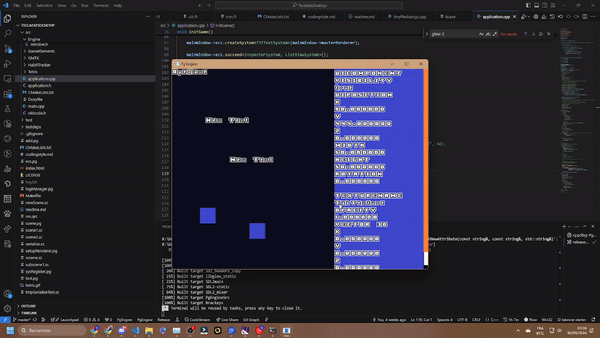
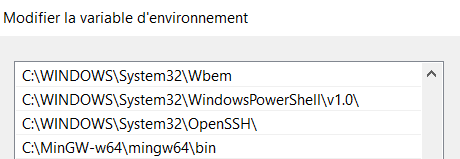

# Pg Engine

A pure Entity Component System based Graphical Engine

# Design Goals
- **Useful**: A complete 2D set with an upcoming 3D support
- **Simple**: Flexible with access to all the engine code and easy access for new users with a built in editor
- **Fast**: Make the best use of C++ concept and can execute system in parallel thanks to support of Taskflow
- **Data Focused**: Heavy use of the Entity Component System Paradigm with support to event between systems
- **Pay only for what you use**: Don't lose any performance while not using a system
- **Adaptative**: Every thing is scriptable using PgScript and mod support can be easily enabled on the final release.

# Engine

A custom engine is available to create 2D scene 

# Exemple of game made using this engine

## Tetris clone

A full fledge tetris clone using texture, entities and sound effects using this engine

You can find all the game that I made using this engine at:
https://pigeoncodeur.itch.io/

## Warning
PGEngine is still in the early stage of development, important features are missing and expect some code bracking update changes happening with some migration guides provided ! 

# How to build

## Download external depencies

The first step to build is to download the two external depencies of this project:
- Any C++ compiler that can handle 64bits build
- Cmake

### Unix
- `sudo apt install cmake`
- `sudo apt-get install libgl1-mesa-dev`
- `sudo apt-get install libsdl2-dev`
- `sudo apt-get install libsdl2-ttf-dev`
- `mkdir release`
- `cd release`
- `cmake -S ../ -B .`
- `cmake --build . --target all -j 11`

### Windows

The first step is to install [Mingw 64](https://www.mingw-w64.org/downloads/) 

The next step is to install Cmake

Once mingw is installed, add the bin folder in your PATH to use make !

Once those depencies are resolved, you can build the application by :
Creating a folder named `release` at the root of the project
then enter in it and run:
- `cmake -S ../ -B . -G "MinGW Makefiles"`
After it is done you can execute any of those command to build the project:
- `cmake --build release --config Release --target all` in release mode
- `cmake --build debug --config Debug --target all` in debug mode

Or use the different task set up for vscode

### For webassembly
Start by installing Emscripten
https://emscripten.org/docs/getting_started/downloads.html

then:

- `mkdir em`
- `cd em`
- `emcmake cmake ..`
- `cmake --build . --target all -j 11`

To test and deploy web build
- `emrun .\PgEngine.html`

## Profiling App

To profile the Taskflow scheduling of the application, you need to enable the profiler in your environment by setting the filename in the environment variable

On windows:
- `$env:TF_ENABLE_PROFILER=simple.json`

Create all the uml using:
https://plantuml.com/fr/sequence-diagram

## Your contributions
If you want to contribute to the project, please follow the [coding style](codingstyle.md) before sending a PR
